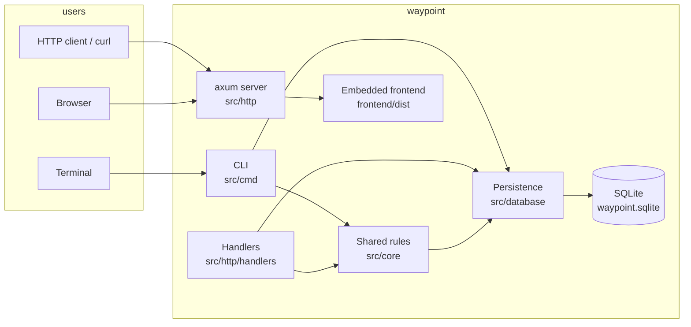
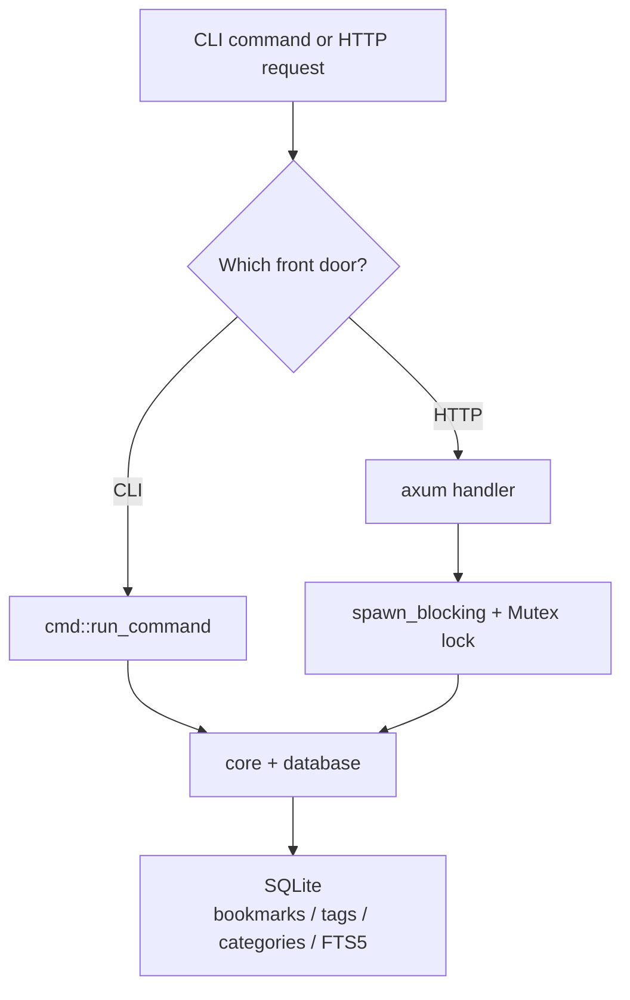
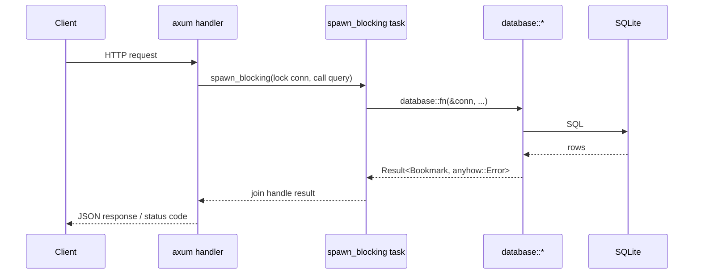

# DEV.md

How waypoint behaves as a developer and API consumer. For a walkthrough of
how it's built internally, see [DEV_IN_DEPTH.md](DEV_IN_DEPTH.md); for
end-user usage see [README.md](README.md).

## Architecture overview

waypoint is one Rust library crate (`src/lib.rs`) with a thin binary shell
(`src/main.rs`) and three front doors onto the same SQLite database: a CLI,
an HTTP API, and a web UI that consumes the API. All bookmarks, categories,
and tags live in a single SQLite file; search is SQLite FTS5.



### Components

- **CLI (`src/cmd/`)** — clap-parsed, grouped subcommands: `bookmarks`,
  `tags`, `categories`, `trash`, `stats`, `check`, and `serve`. Every
  command except `serve` opens its own connection and runs synchronously;
  `serve` hands off to the async server. `trash` and `stats` are optional
  subcommand groups — bare `waypoint trash` lists the recycle bin, bare
  `waypoint stats` shows the overview. `check` probes bookmark URLs over the
  network (`src/core/checker.rs`) using `--jobs` (default 8) worker threads;
  deletion happens back on the calling thread.
- **HTTP server (`src/http/`)** — axum router with a REST API under `/api`,
  top-level `/keywords` and `/keywords/:keyword` redirect routes, the raw
  OpenAPI spec at `/api/openapi.json`, and a static fallback that serves the
  embedded frontend.
- **Shared rules (`src/core/`)** — the seam that keeps CLI and HTTP behavior
  identical: the table-driven favicon/thumbnail media resolver (`media.rs` +
  `sites/`), URL helpers, import/export, and the link checker. Both front
  doors call here, never each other.
- **Persistence (`src/database/`)** — every SQL statement lives in this
  module. Versioned, forward-only migrations (tracked in `schema_migrations`)
  replace the old re-run-every-startup schema file, and `open()` upgrades
  pre-versioned databases in place.
- **Models (`src/model.rs`, `src/shared.rs`)** — pure structs and stateless
  validation helpers, so a rule (e.g. keyword charset, limit range) can't
  drift between the CLI and the API.
- **Logger (`src/logging`)** — hand-rolled structured logger (pretty or
  JSON), initialized once from CLI flags.

### Data flow



### Request lifecycle

Every HTTP handler follows the same shape: clone the shared `Arc<Mutex<
Connection>>`, run the query inside `tokio::task::spawn_blocking`, then
`await??` the join handle (the first `?` unwraps the `JoinError`, the second
converts the inner `anyhow::Error` into the HTTP error type).



## Build system

- **Dev server with live frontend**: build the SPA first (`cd frontend &&
  bun run build`), then `cargo run -- serve --static-dir frontend/dist/` —
  serves the built `frontend/dist/` from disk. The flag only exists in
  debug builds.
- **Release binary**: `cargo build --release` — embeds `frontend/dist/`
  via `rust-embed` and has no `--static-dir` flag at all, so a release
  binary is fully self-contained.
- **Checks**: `cargo check`, `cargo clippy --all-targets`,
  `cargo fmt --check`, `cargo test`. Clippy is clean except for the
  deliberately-unused logging infrastructure (`next_request_id`,
  `log_set_level`/`log_get_level`, `log_use_color`, `truncate_for_log`) —
  keep that dead code, it's intentional.
- **Cargo features**: `show_time_stamp` (adds `chrono`, timestamps in log
  lines) and `show_source_location` (file:line:func in log lines). Both are
  default-on, but source locations only render in debug builds — the code
  path is gated on `debug_assertions`, so release logs show timestamps
  only.
- **Database**: `rusqlite` with the `bundled` feature, so SQLite is
  compiled from source and FTS5 is always available — no system SQLite
  dependency. **`utoipa` uses the `macros` feature flag** (not `derive`,
  which doesn't exist), and there is no `utoipa-swagger-ui` dependency: the
  vendored UI embedded ~5MB of assets into the release binary, so it was
  dropped in favor of the raw `/api/openapi.json` spec.
- **No build steps for the frontend** — it's plain HTML/CSS/JS, embedded
  as static assets.

## HTTP API

Authentication is optional. Pass `--api-token <token>` (or
`WAYPOINT_SERVE_TOKEN`) to `serve` to require `Authorization: Bearer
<token>` on every `/api/*` request and on `/api/openapi.json`; without a
token everything is open. The `/keywords`
routes and the static frontend are never gated (a browser address bar can't
send an `Authorization` header). The server binds `localhost` by default and
is meant for a trusted personal network; the API speaks plain HTTP, so use a
token only on a trusted network or behind a reverse proxy that terminates
TLS.

Errors are JSON objects with a human message and a stable machine-readable
code: `{"error": "<message>", "code": "<code>"}`. See the `ErrorCode` enum
in `src/http/error.rs` for the authoritative list; the codes are:
`invalid_url`, `invalid_keyword`, `invalid_limit`, `invalid_offset`,
`invalid_id`, `invalid_name`, `invalid_date`, `query_required` (all `400`),
`unauthorized` (`401`),
`not_found` (`404`), `conflict_url` / `conflict_keyword` (`409`),
`internal_error` (`500`).

Status codes: `200 OK`, `201 Created`, `204 No Content`, `307 Temporary
Redirect`, `400 Bad Request`, `401 Unauthorized`, `404 Not Found`,
`409 Conflict` (duplicate URL or keyword), `500 Internal Server Error`.

Pagination: `GET /api/bookmarks` and `GET /api/search` accept `limit`
(1–1000, default 200 list / 50 search) and `offset` (≥ 0); out-of-range
values are rejected with `400` rather than silently clamped. Both return
the total number of matching bookmarks (ignoring `limit`/`offset`) in the
`x-total-count` response header — note the lowercase name, axum 0.8 doesn't
normalize header casing.

Time bounds: list/search/bulk-delete accept `*_after` / `*_before` values
in `YYYY-MM-DD[ HH:MM[:SS]]` (UTC). A bare date covers the whole day —
`*_after` starts at `00:00:00`, `*_before` ends at `23:59:59` (via
`shared::parse_datetime_bound`, mirrored by `http::handlers::parse_bound`).
Garbage input is `400 invalid_date`. Bounds are compared against the stored
fixed-width UTC strings, so plain `>=` / `<=` is chronological. A NULL
`last_visited_at` (never visited) matches `visited_before` but never
`visited_after`.

The raw OpenAPI spec is served at `/api/openapi.json`, generated from
`#[utoipa::path]` annotations on the handlers. There is no interactive
Swagger UI — the vendored UI was dropped to keep the release binary small
(the spec remains for external tooling).

### `GET /keywords/:keyword`

307-redirects to the bookmark's URL and records a visit (fire-and-forget,
does not block the redirect). Returns `404` with a plain-text body if no
active bookmark has that keyword.

### `GET /api/bookmarks`

List bookmarks. Query parameters (all optional): `category`, `category_id`,
`tag`, `keyword`, `starred`, `archived`, `trash`, `created_after/before`,
`updated_after/before`, `visited_after/before`, `trashed_after/before`,
`limit`, `offset`.

- `archived`: omitted = both active and archived; `true` = archived only;
  `false` = active only. Trashed bookmarks are always excluded.
- `trash`: `true` lists only the recycle bin (trashed bookmarks),
  overriding `archived` and the other filters; ordered most-recently-
  trashed first.
- `limit` defaults to 200 (1–1000, rejected with `400 invalid_limit`
  outside that range); `offset` defaults to 0 (`400 invalid_offset` if
  negative). The response carries the total match count in the
  `x-total-count` header.
- Response: `200` with a JSON array of `Bookmark` objects, ordered newest
  first.

### `POST /api/bookmarks`

Create a bookmark. Body is a `NewBookmark` JSON object; only `url` is
required.

- `url` missing/empty → `400 invalid_url`.
- Keyword outside the safe charset (`[A-Za-z0-9._-]`, since keywords
  become URL path segments) → `400 invalid_keyword`.
- Duplicate URL or keyword (among active bookmarks) → `409 conflict_url`
  or `409 conflict_keyword`. The duplicate-URL case is a friendly
  pre-check in `database::bookmarks::insert`, special-cased to 409 by
  `http::error.rs`; the duplicate-keyword case is the SQLite UNIQUE
  violation.
- Media modes: `favicon_mode` / `thumbnail_mode` accept `"auto"` (derive
  from the URL — the default), `"fetch"` (scrape the page at save time;
  degrades to the auto result on network failure), or `"default"` (store
  the bundled-asset token `\0default-favicon` / `\0default-thumbnail`,
  which the frontend renders as `/favicon.ico` / `/thumb-default.svg`).
  When set, a mode wins over an explicit `favicon` / `thumbnail` URL.
- Response: `201` with the created `Bookmark` object. Favicon and
  thumbnail are populated synchronously by `core::media`.

### `GET /api/bookmarks/:id`

`200` with the `Bookmark`, or `404` if missing or trashed.

### `PUT /api/bookmarks/:id`

Partial update — omitted or `null` fields are left unchanged. Body is an
`UpdateBookmark` JSON object.

- `keyword` tri-state: omitted/`null` = unchanged, `""` = clear, any other
  string = set.
- `tags`, when present, replaces the whole tag set (`[]` clears);
  `add_tags` / `remove_tags` adjust it instead.
- `url` present but blank → `400 invalid_url` (previously it silently
  wrote an empty URL).
- `favicon_mode` / `thumbnail_mode` work like the create modes: `auto`
  re-derives from the (possibly new) URL, `default` resets to the bundled
  token, `fetch` re-scrapes now. Successful `fetch` results are cached on
  disk for 90 days (`WAYPOINT_CACHE_DIR`, platform cache dir by default).
- `refresh: true` re-scrapes the favicon and thumbnail now, bypassing the
  fetched-media cache (explicit `favicon` / `thumbnail` / `*_mode` values
  in the same body still win). Omitted/`false` leaves caching untouched.
- Response: `200` with the updated `Bookmark`, or `404`.

### `DELETE /api/bookmarks/:id`

Move the bookmark to the trash (recycle bin). `204` on success,
`404` if the bookmark doesn't exist or is already trashed. Add
`?purge=true` to permanently delete it instead.

### `POST /api/bookmarks/:id/restore`

Restore a trashed bookmark from the recycle bin. `204` on success,
`404` if the bookmark doesn't exist or isn't in the trash. Restoring
re-indexes the bookmark into FTS search.

### `DELETE /api/bookmarks` (bulk)

Remove many bookmarks at once, either by an explicit list or by filter
criteria — **never both, and never a bare catch-all** (a call with no `ids`
and no criterion is `400`, so a stray `DELETE /api/bookmarks` can't gut the
database).

Query parameters: `ids` (comma-separated) **or** any of the filter criteria
`category`, `category_id`, `tag`, `keyword`, `starred`, `archived`,
`trash`, `created_after/before`, `updated_after/before`,
`visited_after/before`, `trashed_after/before` — the same fields as
`GET /api/bookmarks`. Plus `purge` (`true` = delete permanently instead of
trashing) and `dry_run` (`true` = report the matching ids/count without
changing anything).

Response: `200` with `{"ids": [<matched ids>], "removed": <n>}`. In a
dry run `removed` is always `0`. Trashed bookmarks are invisible to
criteria matching, so a second bulk call matches nothing new.

### `DELETE /api/trash` (empty trash)

Permanently purge the recycle bin. Query parameters: `before`
(`YYYY-MM-DD[ HH:MM[:SS]]`, only purge bookmarks trashed at or before that
time) and `dry_run` (`true` = preview the ids, purge nothing). Response:
`200` with the same `BulkRemoveResult` shape. The frontend gates the real
call behind its own confirmation dialog.

### `GET /api/categories`

`200` with a JSON array of `{"id", "name"}` objects, alphabetical.

### `PUT /api/categories/:id`

Rename a category. Body: `{"name": "New name"}`. All bookmarks in this
category move with it.

- `200` on success.
- `400 invalid_name` for an empty name or the default ("Uncategorized")
  category — it cannot be renamed.
- `404` if the category doesn't exist.

### `DELETE /api/categories/:id`

Delete a category. Its bookmarks are **moved to the default category**
first — deleting a category never destroys bookmarks (the raw `ON DELETE
CASCADE` on `bookmarks.category_id` is deliberately neutralized in
`database::categories::delete`).

- `204` on success.
- `400 invalid_name` for the default category — it cannot be deleted.
- `404` if the category doesn't exist.

### `GET /api/tags`

`200` with a JSON array of `{"name", "count"}` objects, most-used first.

### `PUT /api/tags/:name`

Rename a tag. Body: `{"name": "New name"}`. All bookmark-tag associations
move with it.

- `200` on success.
- `400 invalid_name` for an empty name.
- `404` if the tag doesn't exist.

### `DELETE /api/tags/:name`

Delete a tag. All bookmark-tag associations for it are removed (bookmarks
are untouched). `204` on success, `404` if the tag doesn't exist.

### `GET /api/search?q=<query>`

Full-text search across titles, descriptions, notes, and URLs.

- `q` is required; missing or blank → `400 query_required`.
- The query is treated as a phrase and escaped, so FTS5 syntax (`"`,
  `*`, `:`, `NEAR`, ...) in user input cannot error out the query.
- `limit` defaults to 50 (1–1000, rejected with `400 invalid_limit`
  outside that range). The response carries the total match count in the
  `x-total-count` header.
- `archived`: `true` searches the archive index instead — archived
  bookmarks live in `bookmarks_fts_archived`, physically separate from the
  main corpus, so they only surface here (never in default search).
- Narrowing: `category`, `tag`, and `keyword` (exact shortcut) filter the
  FTS results; the count (`x-total-count`) reflects the narrowed set.
- Response: `200` with a JSON array of `Bookmark` objects, ranked.

### `GET /api/stats/domains`

`200` with a JSON array of `{"domain", "count"}` objects (bookmark count per
domain, descending; ties alphabetical). Active bookmarks only. Query params:
`limit` (default 50), `offset` (default 0).

### `GET /api/stats`

`200` with a JSON `StatsOverview` object: `total`, `starred`, `archived`,
`trashed` (all `i64`), `categories` (array of `{"name", "count"}`),
`top_domains` (top 5 `DomainCount`), `top_tags` (top 5 `TagCount`),
`most_visited` and `recently_added` (each top 5 `BookmarkVisitStats`).

### `GET /api/stats/tags`

`200` with a JSON array of `{"name", "count"}` objects (most-used first;
ties alphabetical). Unlike `GET /api/tags` (which returns every tag) this is
paged: `limit` (default 50), `offset` (default 0).

### `GET /api/stats/bookmarks/:id`

`200` with the full `Bookmark` JSON object for that ID (with tags attached),
or `404` if the bookmark doesn't exist or is trashed.

### `GET /api/stats/top-visited`

`200` with a JSON array of `DomainVisitStats` objects: `domain`,
`total_visits` (sum of `visit_count` across all bookmarks for that
domain), `bookmark_count`. Ordered by `total_visits` descending. Query
params: `limit` (default 20), `offset` (default 0).

### `GET /api/stats/never-visited`

`200` with a JSON array of `NeverVisitedBookmark` objects: `id`, `title`,
`url`, `domain`, `created_at`. Bookmarks with `visit_count = 0`, ordered
most-recently-created first. Query params: `limit` (default 50),
`offset` (default 0).

### `GET /api/stats/orphan-tags`

`200` with a JSON array of `OrphanTag` objects: `name`, `bookmark_id`,
`bookmark_title`. Tags applied to exactly one active bookmark. Query params:
`limit` (default 50), `offset` (default 0).

### `GET /api/stats/hygiene`

`200` with a `HygieneStats` object: `total`, `missing_tags`,
`missing_note`, `missing_description` (all `i64`). Counts bookmarks with
no tags, no note, or no description among active bookmarks.

### `GET /api/stats/activity`

`200` with a JSON array of `MonthlyActivity` objects: `month`
(`"YYYY-MM"`), `count`. Bookmarks grouped by creation month, most recent
first. Query params: `limit` (default 12), `offset` (default 0).

### Bookmark JSON shape

```json
{
  "id": 1,
  "title": "Example",
  "url": "https://example.com",
  "description": null,
  "domain": "example.com",
  "category_id": 1,
  "category_name": "Uncategorized",
  "starred": false,
  "keyword": null,
  "note": null,
  "favicon": "https://example.com/favicon.ico",
  "thumbnail": null,
  "visit_count": 0,
  "last_visited_at": null,
  "is_archived": false,
  "trashed_at": null,
  "created_at": "2026-08-03 12:00:00",
  "updated_at": "2026-08-03 12:00:00",
  "tags": []
}
```

## Example requests and responses

The examples below walk one realistic session against a server on
`localhost:8080` (no token): a developer collects links, tidies them up, and
cleans house. Error responses use `curl -q` to bypass any
`--fail`/`--silent`/`--show-error` flags in `~/.curlrc` so the JSON body
actually prints.

### Create a bookmark with full metadata

`favicon_mode: "fetch"` and `thumbnail_mode: "fetch"` make the server scrape
the page at save time; `keyword: "rick"` installs a shortcut at
`/keywords/rick`. Tags are stored alphabetically, so the response order may
differ from the request.

```bash
curl -s -X POST http://localhost:8080/api/bookmarks \
  -H 'Content-Type: application/json' \
  -d '{
    "url": "https://www.youtube.com/watch?v=dQw4w9WgXcQ",
    "title": "Never Gonna Give You Up",
    "category": "fun",
    "tags": ["music", "classics"],
    "keyword": "rick",
    "note": "The definitive internet classic.",
    "description": "The 1987 hit that refuses to die.",
    "favicon_mode": "fetch",
    "thumbnail_mode": "fetch",
    "starred": true
  }'
```

`201 Created`:

```json
{
  "id": 12,
  "title": "Never Gonna Give You Up",
  "url": "https://www.youtube.com/watch?v=dQw4w9WgXcQ",
  "description": "The 1987 hit that refuses to die.",
  "domain": "www.youtube.com",
  "category_id": 3,
  "category_name": "fun",
  "starred": true,
  "keyword": "rick",
  "note": "The definitive internet classic.",
  "favicon": "https://www.youtube.com/s/desktop/favicon.ico",
  "thumbnail": "https://i.ytimg.com/vi/dQw4w9WgXcQ/maxresdefault.jpg",
  "visit_count": 0,
  "last_visited_at": null,
  "is_archived": false,
  "trashed_at": null,
  "created_at": "2026-08-06 09:14:03",
  "updated_at": "2026-08-06 09:14:03",
  "tags": ["classics", "music"]
}
```

### Create a minimal bookmark

Only `url` is required. `title` defaults to the URL and the bookmark lands
in the default "Uncategorized" category.

```bash
curl -s -X POST http://localhost:8080/api/bookmarks \
  -H 'Content-Type: application/json' \
  -d '{"url": "https://doc.rust-lang.org/cargo/"}'
```

`201 Created`:

```json
{
  "id": 13,
  "title": "https://doc.rust-lang.org/cargo/",
  "url": "https://doc.rust-lang.org/cargo/",
  "description": null,
  "domain": "doc.rust-lang.org",
  "category_id": 1,
  "category_name": "Uncategorized",
  "starred": false,
  "keyword": null,
  "note": null,
  "favicon": "https://doc.rust-lang.org/favicon.ico",
  "thumbnail": null,
  "visit_count": 0,
  "last_visited_at": null,
  "is_archived": false,
  "trashed_at": null,
  "created_at": "2026-08-06 09:20:47",
  "updated_at": "2026-08-06 09:20:47",
  "tags": []
}
```

`201 Created` with only `url` — `title` defaults to the URL, the category to
"Uncategorized", and auto mode still resolves a favicon for every site: a
site-specific rule if one exists, else the generic
`{scheme}://{host}/favicon.ico` (here `https://doc.rust-lang.org/favicon.ico`).

### Duplicate URL

Posting a URL that already exists among active bookmarks is a friendly 409,
not a database error.

```bash
curl -q -s -X POST http://localhost:8080/api/bookmarks \
  -H 'Content-Type: application/json' \
  -d '{"url": "https://www.youtube.com/watch?v=dQw4w9WgXcQ"}'
```

`409 Conflict`:

```json
{
  "error": "URL already exists as bookmark #12 (Never Gonna Give You Up)",
  "code": "conflict_url"
}
```

### Invalid keyword

Keywords become URL path segments, so the charset is limited to
`[A-Za-z0-9._-]` — spaces and other punctuation are rejected up front.

```bash
curl -q -s -X POST http://localhost:8080/api/bookmarks \
  -H 'Content-Type: application/json' \
  -d '{"url": "https://example.com", "keyword": "my bookmark"}'
```

`400 Bad Request`:

```json
{
  "error": "keyword may only contain letters, digits, '.', '_' and '-'",
  "code": "invalid_keyword"
}
```

### List with filters and pagination

The response is a plain JSON array; the total match count (ignoring
`limit`/`offset`) travels in the **lowercase** `x-total-count` header.

```bash
curl -s 'http://localhost:8080/api/bookmarks?starred=true&limit=2&offset=0'
```

`200 OK` — headers: `x-total-count: 2` (lowercase, as axum 0.8 sends it):

```json
[
  {
    "id": 12,
    "title": "Never Gonna Give You Up",
    "url": "https://www.youtube.com/watch?v=dQw4w9WgXcQ",
    "description": "The 1987 hit that refuses to die.",
    "domain": "www.youtube.com",
    "category_id": 3,
    "category_name": "fun",
    "starred": true,
    "keyword": "rick",
    "note": "The definitive internet classic.",
    "favicon": "https://www.youtube.com/s/desktop/favicon.ico",
    "thumbnail": "https://i.ytimg.com/vi/dQw4w9WgXcQ/maxresdefault.jpg",
    "visit_count": 4,
    "last_visited_at": "2026-08-06 09:18:44",
    "is_archived": false,
    "trashed_at": null,
    "created_at": "2026-08-06 09:14:03",
    "updated_at": "2026-08-06 09:14:03",
    "tags": ["classics", "music"]
  },
  {
    "id": 9,
    "title": "The Rust Book",
    "url": "https://doc.rust-lang.org/book/",
    "description": "The official Rust language book.",
    "domain": "doc.rust-lang.org",
    "category_id": 2,
    "category_name": "dev",
    "starred": true,
    "keyword": "trpl",
    "note": null,
    "favicon": "https://doc.rust-lang.org/favicon.ico",
    "thumbnail": null,
    "visit_count": 17,
    "last_visited_at": "2026-08-06 08:05:44",
    "is_archived": false,
    "trashed_at": null,
    "created_at": "2026-07-28 19:02:31",
    "updated_at": "2026-08-02 11:40:12",
    "tags": ["programming", "rust"]
  }
]
```

Out-of-range pagination is rejected rather than clamped:

```bash
curl -q -s 'http://localhost:8080/api/bookmarks?limit=2000'
```

```json
{
  "error": "limit must be between 1 and 1000, got 2000",
  "code": "invalid_limit"
}
```

### Full-text search

The query is treated as a phrase and escaped, so `"`/`*`/`:` in the input
can't error out FTS5. Results are ranked; the total (pre-`limit`) count is
again in `x-total-count`.

```bash
curl -s 'http://localhost:8080/api/search?q=rust&limit=3'
```

`200 OK` — headers: `x-total-count: 2`:

```json
[
  {
    "id": 9,
    "title": "The Rust Book",
    "url": "https://doc.rust-lang.org/book/",
    "description": "The official Rust language book.",
    "domain": "doc.rust-lang.org",
    "category_id": 2,
    "category_name": "dev",
    "starred": true,
    "keyword": "trpl",
    "note": null,
    "favicon": "https://doc.rust-lang.org/favicon.ico",
    "thumbnail": null,
    "visit_count": 17,
    "last_visited_at": "2026-08-06 08:05:44",
    "is_archived": false,
    "trashed_at": null,
    "created_at": "2026-07-28 19:02:31",
    "updated_at": "2026-08-02 11:40:12",
    "tags": ["programming", "rust"]
  },
  {
    "id": 14,
    "title": "Learn Rust With Entirely Too Many Linked Lists",
    "url": "https://rust-unofficial.github.io/too-many-lists/",
    "description": "A from-scratch walkthrough of linked lists in Rust.",
    "domain": "rust-unofficial.github.io",
    "category_id": 2,
    "category_name": "dev",
    "starred": false,
    "keyword": null,
    "note": "Great for learning ownership.",
    "favicon": "https://rust-unofficial.github.io/favicon.ico",
    "thumbnail": null,
    "visit_count": 3,
    "last_visited_at": "2026-08-04 16:20:09",
    "is_archived": false,
    "trashed_at": null,
    "created_at": "2026-08-01 12:44:05",
    "updated_at": "2026-08-01 12:44:05",
    "tags": ["rust"]
  }
]
```

A missing query is a 400, not an empty result:

```bash
curl -q -s 'http://localhost:8080/api/search'
```

```json
{
  "error": "q is required (the text to search for)",
  "code": "query_required"
}
```

### Get one bookmark

```bash
curl -s http://localhost:8080/api/bookmarks/12
```

`200 OK` with the full `Bookmark` object (same shape as the create
response). A missing or trashed id is `404`:

```bash
curl -q -s http://localhost:8080/api/bookmarks/999
```

```json
{
  "error": "bookmark not found",
  "code": "not_found"
}
```

### Keyword redirect

`/keywords/:keyword` is outside `/api` and never auth-gated, so it works
from a browser address bar. It 307-redirects (preserving the request method
and body across the hop) and records a visit fire-and-forget.

```bash
curl -sI http://localhost:8080/keywords/rick
```

`307 Temporary Redirect` — headers:

```
HTTP/1.1 307 Temporary Redirect
location: https://www.youtube.com/watch?v=dQw4w9WgXcQ
```

An unknown keyword is a plain-text 404, not the JSON error contract:

```bash
curl -s http://localhost:8080/keywords/nope
```

`404 Not Found` — `no bookmark for keyword "nope"`.

### Open bookmark (record visit)

`GET /open/:id` is the id-based twin of `/keywords/:keyword`, also outside
`/api` and never auth-gated. The frontend card titles and the detail-panel
Open button point here, so opening a bookmark from the UI counts as a visit
even when it has no keyword shortcut. It 307-redirects to the bookmark URL
and records a visit fire-and-forget.

```bash
curl -sI http://localhost:8080/open/7
```

`307 Temporary Redirect` — headers:

```
HTTP/1.1 307 Temporary Redirect
location: https://www.youtube.com/watch?v=dQw4w9WgXcQ
```

An unknown id is a plain-text 404: `no bookmark with id #999`.

### Update a bookmark

Partial update — omitted fields are left unchanged. This call adds a tag,
clears the keyword (`""` is the "clear" tri-state), resets the favicon to
the bundled default asset, and re-scrapes the thumbnail now
(`refresh: true` bypasses the 90-day fetched-media cache).

```bash
curl -s -X PUT http://localhost:8080/api/bookmarks/12 \
  -H 'Content-Type: application/json' \
  -d '{
    "title": "Rick Astley - Never Gonna Give You Up",
    "add_tags": ["memes"],
    "keyword": "",
    "favicon_mode": "default",
    "thumbnail_mode": "fetch",
    "refresh": true
  }'
```

`200 OK`:

```json
{
  "id": 12,
  "title": "Rick Astley - Never Gonna Give You Up",
  "url": "https://www.youtube.com/watch?v=dQw4w9WgXcQ",
  "description": "The 1987 hit that refuses to die.",
  "domain": "www.youtube.com",
  "category_id": 3,
  "category_name": "fun",
  "starred": true,
  "keyword": null,
  "note": "The definitive internet classic.",
  "favicon": "\u0000default-favicon",
  "thumbnail": "https://i.ytimg.com/vi/dQw4w9WgXcQ/maxresdefault.jpg",
  "visit_count": 4,
  "last_visited_at": "2026-08-06 09:18:44",
  "is_archived": false,
  "trashed_at": null,
  "created_at": "2026-08-06 09:14:03",
  "updated_at": "2026-08-06 09:20:51",
  "tags": ["classics", "memes", "music"]
}
```

The `\u0000default-favicon` token is the documented bundled-asset sentinel:
the frontend renders it as the locally served `/favicon.ico`.

### Bulk delete — dry run, then the real thing

Filter-based deletion never runs blind: a dry run reports what _would_
match, and a call with neither `ids` nor any criterion is rejected. Filters
use the same query parameters as `GET /api/bookmarks` (a tag filter is
`tag=stale`, not `tags`).

```bash
curl -q -s -X DELETE 'http://localhost:8080/api/bookmarks?tag=stale&dry_run=true'
```

`200 OK`:

```json
{
  "ids": [21, 22],
  "removed": 0
}
```

Repeating without `dry_run` moves the two matches to the trash:

```bash
curl -q -s -X DELETE 'http://localhost:8080/api/bookmarks?tag=stale'
```

`200 OK`:

```json
{
  "ids": [21, 22],
  "removed": 2
}
```

### Empty the trash

```bash
curl -q -s -X DELETE 'http://localhost:8080/api/trash?dry_run=true'
```

`200 OK`:

```json
{
  "ids": [21, 22],
  "removed": 0
}
```

`DELETE /api/trash` without `dry_run` permanently purges the recycle bin
(`removed` then reflects the purge).

### Stats overview

`GET /api/stats` returns the full aggregated overview in one call.

```bash
curl -s http://localhost:8080/api/stats
```

`200 OK`:

```json
{
  "total": 7,
  "starred": 2,
  "archived": 1,
  "trashed": 2,
  "categories": [
    { "name": "dev", "count": 3 },
    { "name": "Uncategorized", "count": 1 },
    { "name": "fun", "count": 1 }
  ],
  "top_domains": [
    { "domain": "doc.rust-lang.org", "count": 3 },
    { "domain": "rust-unofficial.github.io", "count": 1 },
    { "domain": "www.youtube.com", "count": 1 }
  ],
  "top_tags": [
    { "name": "rust", "count": 2 },
    { "name": "stale", "count": 2 },
    { "name": "classics", "count": 1 },
    { "name": "memes", "count": 1 },
    { "name": "music", "count": 1 }
  ],
  "most_visited": [
    {
      "id": 9,
      "title": "The Rust Book",
      "url": "https://doc.rust-lang.org/book/",
      "domain": "doc.rust-lang.org",
      "visit_count": 17,
      "last_visited_at": "2026-08-06 08:05:44",
      "created_at": "2026-07-28 19:02:31"
    }
  ],
  "recently_added": [
    {
      "id": 13,
      "title": "https://doc.rust-lang.org/cargo/",
      "url": "https://doc.rust-lang.org/cargo/",
      "domain": "doc.rust-lang.org",
      "visit_count": 0,
      "last_visited_at": null,
      "created_at": "2026-08-06 09:20:47"
    }
  ]
}
```

Counting quirk worth knowing: `categories` and `top_domains` exclude
trashed bookmarks, but `top_tags` still counts them — which is why the
trashed pair (the bulk-deleted `stale` bookmarks) keeps `stale` at count 2
even though those rows are in the recycle bin.

### Token-protected server

With `serve --api-token` set, every `/api/*` request needs a bearer token.
A missing or wrong token is `401` with the JSON error contract (the
comparison is constant-time).

```bash
curl -q -s http://localhost:8080/api/stats
```

`401 Unauthorized`:

```json
{
  "error": "invalid or missing API token",
  "code": "unauthorized"
}
```

```bash
curl -s http://localhost:8080/api/stats \
  -H 'Authorization: Bearer s3cret'
```

`200 OK` — same response as the unauthenticated example above.

### Stats drill-downs

The overview endpoint aggregates; each sub-resource answers one question. All
of them exclude trashed bookmarks unless noted.

`GET /api/stats/domains` — bookmark count per domain, most-used first (ties
alphabetically):

```bash
curl -s http://localhost:8080/api/stats/domains
```

`200 OK`:

```json
[
  { "domain": "doc.rust-lang.org", "count": 3 },
  { "domain": "rust-unofficial.github.io", "count": 1 },
  { "domain": "www.youtube.com", "count": 1 }
]
```

`GET /api/stats/top-visited` — visits per domain, so one popular site
outranks a pile of stale links:

```bash
curl -s http://localhost:8080/api/stats/top-visited
```

`200 OK`:

```json
[
  { "domain": "doc.rust-lang.org", "total_visits": 22, "bookmark_count": 3 },
  { "domain": "www.youtube.com", "total_visits": 4, "bookmark_count": 1 },
  { "domain": "rust-unofficial.github.io", "total_visits": 3, "bookmark_count": 1 }
]
```

The 22 on `doc.rust-lang.org` is the sum of bookmarks 8 (5) and 9 (17).

`GET /api/stats/never-visited` — active bookmarks nobody has opened yet:

```bash
curl -s http://localhost:8080/api/stats/never-visited
```

`200 OK`:

```json
[
  {
    "id": 13,
    "title": "https://doc.rust-lang.org/cargo/",
    "url": "https://doc.rust-lang.org/cargo/",
    "domain": "doc.rust-lang.org",
    "created_at": "2026-08-06 09:20:47"
  }
]
```

`GET /api/stats/orphan-tags` — tags used by exactly one active bookmark, a
hint that a tag is worth merging or deleting:

```bash
curl -s http://localhost:8080/api/stats/orphan-tags
```

`200 OK`:

```json
[
  { "name": "classics", "bookmark_id": 12, "bookmark_title": "Never Gonna Give You Up" },
  { "name": "memes", "bookmark_id": 12, "bookmark_title": "Never Gonna Give You Up" },
  { "name": "music", "bookmark_id": 12, "bookmark_title": "Never Gonna Give You Up" },
  { "name": "programming", "bookmark_id": 9, "bookmark_title": "The Rust Book" }
]
```

Trashed bookmarks are ignored, so `stale` (only on the two trashed links)
does not appear.

`GET /api/stats/hygiene` — one row of fill-in-the-blank counts across active
bookmarks:

```bash
curl -s http://localhost:8080/api/stats/hygiene
```

`200 OK`:

```json
{
  "total": 5,
  "missing_tags": 2,
  "missing_note": 3,
  "missing_description": 1
}
```

`GET /api/stats/activity` — bookmarks created per month, most recent first;
trashed bookmarks are not counted:

```bash
curl -s http://localhost:8080/api/stats/activity
```

`200 OK`:

```json
[
  { "month": "2026-08", "count": 3 },
  { "month": "2026-07", "count": 2 }
]
```

Every paged stats endpoint (`domains`, `tags`, `top-visited`,
`never-visited`, `orphan-tags`, `activity`) takes the same `limit`/`offset`
query params as the bookmark list. Paging the domain ranking:

```bash
curl -s 'http://localhost:8080/api/stats/domains?limit=1&offset=1'
```

`200 OK` — the second-most-bookmarked domain, skipping the top row:

```json
[
  { "domain": "rust-unofficial.github.io", "count": 1 }
]
```

A `limit` outside `1..=1000` is a `400` `invalid_limit`, matching the list
endpoints.

### The recycle bin

`DELETE /api/bookmarks/:id` moves a bookmark to the trash; `?trash=true`
lists only the trash. Restore and purge are separate verbs:

```bash
curl -s 'http://localhost:8080/api/bookmarks?trash=true'
```

`200 OK` — each entry is the full bookmark object with `trashed_at` set:

```json
[
  {
    "id": 21,
    "title": "Old link A",
    "url": "https://old.example/a",
    "description": null,
    "domain": "old.example",
    "category_id": 1,
    "category_name": "Uncategorized",
    "starred": false,
    "keyword": null,
    "note": null,
    "favicon": "\u0000default-favicon",
    "thumbnail": "\u0000default-thumbnail",
    "visit_count": 0,
    "last_visited_at": null,
    "is_archived": false,
    "created_at": "2026-07-15 10:00:00",
    "updated_at": "2026-07-15 10:00:00",
    "trashed_at": "2026-08-06 09:45:00",
    "tags": ["stale"]
  },
  {
    "id": 22,
    "title": "Old link B",
    "url": "https://old.example/b",
    "description": null,
    "domain": "old.example",
    "category_id": 1,
    "category_name": "Uncategorized",
    "starred": false,
    "keyword": null,
    "note": null,
    "favicon": "\u0000default-favicon",
    "thumbnail": "\u0000default-thumbnail",
    "visit_count": 0,
    "last_visited_at": null,
    "is_archived": false,
    "created_at": "2026-07-14 09:00:00",
    "updated_at": "2026-07-14 09:00:00",
    "trashed_at": "2026-08-06 09:45:05",
    "tags": ["stale"]
  }
]
```

Restore puts a bookmark back:

```bash
curl -q -s -X POST http://localhost:8080/api/bookmarks/21/restore
```

`204 No Content` — bookmark 21 is active again and its `trashed_at` is null.

Purge is permanent:

```bash
curl -q -s -X DELETE 'http://localhost:8080/api/bookmarks/22?purge=true'
```

`204 No Content` — bookmark 22 is gone from search, FTS, and stats for good:

```bash
curl -s 'http://localhost:8080/api/bookmarks?trash=true'
```

`200 OK` — `[]`.

### Renaming a category

```bash
curl -s -X PUT http://localhost:8080/api/categories/3 \
  -H 'Content-Type: application/json' \
  -d '{"name": "entertainment"}'
```

`200 OK` — empty body; bookmark 12 now reports
`"category_name": "entertainment"`.

The default category is protected:

```bash
curl -q -s -X PUT http://localhost:8080/api/categories/1 \
  -H 'Content-Type: application/json' \
  -d '{"name": "Nope"}'
```

`400 Bad Request`:

```json
{
  "error": "the default category cannot be renamed",
  "code": "invalid_name"
}
```

### Listing categories

Categories come back alphabetically:

```bash
curl -s http://localhost:8080/api/categories
```

`200 OK`:

```json
[
  { "id": 2, "name": "dev" },
  { "id": 3, "name": "entertainment" },
  { "id": 1, "name": "Uncategorized" }
]
```

### Deleting a category

```bash
curl -q -s -X DELETE http://localhost:8080/api/categories/2
```

`204 No Content` — bookmarks 8, 9 and 14 move to the default category instead
of being deleted:

```bash
curl -s http://localhost:8080/api/bookmarks/9
```

`200 OK` (trimmed):

```json
{
  "id": 9,
  "title": "The Rust Book",
  "url": "https://doc.rust-lang.org/book/",
  "category_id": 1,
  "category_name": "Uncategorized",
  "keyword": "trpl",
  "tags": ["programming", "rust"]
}
```

The default category cannot be deleted either:

```bash
curl -q -s -X DELETE http://localhost:8080/api/categories/1
```

`400 Bad Request`:

```json
{
  "error": "the default category cannot be deleted",
  "code": "invalid_name"
}
```

### Managing tags

Renaming a tag rewrites every bookmark that carries it:

```bash
curl -s -X PUT http://localhost:8080/api/tags/music \
  -H 'Content-Type: application/json' \
  -d '{"name": "videos"}'
```

`200 OK` — empty body; bookmark 12's tag is now `videos`.

Deleting a tag strips it from every bookmark:

```bash
curl -q -s -X DELETE http://localhost:8080/api/tags/memes
```

`204 No Content`.

Renaming a tag that does not exist:

```bash
curl -q -s -X PUT http://localhost:8080/api/tags/nope \
  -H 'Content-Type: application/json' \
  -d '{"name": "X"}'
```

`404 Not Found`:

```json
{
  "error": "tag not found",
  "code": "not_found"
}
```

Tags are listed most-used first, ties broken alphabetically, and trashed
bookmarks do not count — so `stale` shows 1 (only the restored bookmark 21
carries it):

```bash
curl -s http://localhost:8080/api/tags
```

`200 OK`:

```json
[
  { "name": "rust", "count": 2 },
  { "name": "classics", "count": 1 },
  { "name": "programming", "count": 1 },
  { "name": "stale", "count": 1 },
  { "name": "videos", "count": 1 }
]
```

### Keyword conflicts

Keywords are unique among active bookmarks, so stealing one is a `409`.
Like duplicate URLs, this is a friendly pre-check — the bookmark is named,
not a raw SQLite constraint message:

```bash
curl -q -s -X POST http://localhost:8080/api/bookmarks \
  -H 'Content-Type: application/json' \
  -d '{"url": "https://conflict.example", "keyword": "trpl"}'
```

`409 Conflict`:

```json
{
  "error": "keyword \"trpl\" already in use by bookmark #9 (The Rust Book)",
  "code": "conflict_keyword"
}
```

The same check fires on `PUT /api/bookmarks/:id` when an update claims a
keyword owned by another bookmark; re-saving a bookmark's own keyword is
fine. A trashed bookmark's keyword never blocks reuse.

### Searching the archive

The default search skips archived bookmarks. Pass `archived=true` to search
the archive index instead:

```bash
curl -s 'http://localhost:8080/api/search?q=rust&archived=true'
```

`200 OK` — finds only bookmark 8, which the default search never sees:

```json
[
  {
    "id": 8,
    "title": "The Rust Reference",
    "url": "https://doc.rust-lang.org/reference/",
    "description": "The official Rust reference manual.",
    "domain": "doc.rust-lang.org",
    "is_archived": true,
    "created_at": "2026-07-20 09:00:00",
    "tags": []
  }
]
```

### The keyword list

`GET /keywords` (no `/api` prefix — a public endpoint, opened from a browser
bar) lists active shortcuts as plain text, one per line:

```bash
curl -s http://localhost:8080/keywords
```

`200 OK` — `text/plain; charset=utf-8`:

```
trpl
```

Only bookmark 9 still has a keyword: bookmark 12's `rick` shortcut was
cleared earlier and the newer bookmarks never installed one.

## Client behavior

The frontend (`frontend/src`) is a React + TypeScript SPA (Vite build,
TanStack Router/Query, shadcn/ui, Tailwind) whose production bundle is
built to `frontend/dist/` and embedded into the binary. The section below
describes the current UI behavior; it is being ported to the new stack.

- **State** — one `state` object (`bookmarks`, `categories`, `tags`,
  `filter`, `searchQuery`); `loadAll()` re-fetches all three lists and
  re-renders.
- **Search** — debounced 250 ms; a non-empty query routes to
  `/api/search` (with `archived=true` when the Archive filter is active,
  so the Archive view searches only archived bookmarks), otherwise
  `/api/bookmarks` with the active filter.
- **Mutations** — every action (star toggle, edit, create, delete) awaits
  its endpoint, then calls `loadAll()` again. There is **no optimistic
  update** logic anywhere.
- **Thumbnails** — a bookmark with `thumbnail` set renders a
  `.card-thumb` block (96px, `object-fit: cover`, `loading="lazy"`) above
  the title.
- **Media modes** — the add/edit dialog has Favicon/Thumbnail selects
  (`auto` / `fetch` / `default`). Only a mode the user actually changed is
  sent, so a plain edit never clobbers stored icons. The bundled-asset
  tokens (`\0default-favicon` / `\0default-thumbnail`) are rendered by
  `assetSrc()` as the locally served `/favicon.ico` / `/thumb-default.svg`.
- **Refine filters** — a sidebar "Refine" group narrows by keyword
  shortcut and created/updated/visited (and, in trash view, trashed) date
  bounds; bare `input[type=date]` values are passed straight through as
  `YYYY-MM-DD`.
- **Bulk remove** — the topbar "Remove…" button opens a criteria dialog
  with a Preview step: Preview sends `DELETE /api/bookmarks?dry_run=true`
  with the criteria and shows the match count, and the confirm step repeats
  the call without `dry_run`. In trash view it becomes "Empty trash" with
  `trash` + `purge` pre-checked.
- **Error handling** — the `request()` helper throws an `Error` with the
  server's `error` field (or the status) on a non-2xx response; the form
  submit shows it via `alert()`, and the initial load renders it inline.
  `204` responses resolve to `null`. The list/search totals use the
  `x-total-count` header when present.
- **Token auth** — when the server is started with `--api-token`, the
  first `401` triggers a single `window.prompt` (shared across the
  parallel `loadAll()` requests via a module-level `tokenPrompt`
  variable), the token is stored in `localStorage["waypoint_token"]`, and
  the request is retried once with an `Authorization: Bearer` header.
- **Not implemented**: retries, request timeouts, streaming/partial
  rendering, offline caching.

## Concurrency

- **One connection, one lock.** The entire server runs against a single
  `rusqlite::Connection` wrapped in an `Arc<Mutex<>>`, touched only inside
  `tokio::task::spawn_blocking` closures. This is a deliberate
  simplification for a personal, single-user tool — SQLite serializes
  writes internally regardless.
- **Visits are fire-and-forget.** `/keywords/:keyword` and `/open/:id` spawn
  an un-awaited `spawn_blocking` to record the visit, so a slow or failed
  write never delays the redirect.
- **`check` probes on worker threads, mutates on the main thread.**
  `src/core/checker.rs` fans bookmarks out to `--jobs` (default 8) worker
  threads that only do network probes; deletion always happens back on the
  calling thread so the single `Connection` is never shared.
- **Not implemented**: connection pooling, rate limiting, request
  queuing, caching layers. Concurrent requests are serialized behind
  the mutex. (Token auth _is_ implemented — see the HTTP API section.)
- **Token check is constant-time.** `src/http/auth.rs` compares the
  presented bearer token with `subtle::ConstantTimeEq`, and the optional
  middleware is only applied to the `/api` router and the docs, never to
  `/keywords` or the static fallback.

## Repo layout

```
waypoint/
├── src/
│   ├── main.rs                  # thin shell: CLI parse → log_init → serve or run_command
│   ├── lib.rs                   # module declarations, layer order, crate docs
│   ├── config.rs                # shared defaults (db path, host, port, limits)
│   ├── model.rs                 # pure structs + DEFAULT_CATEGORY
│   ├── shared.rs                # validation helpers + size caps + extract_domain
│   ├── database/                # open(), versioned migrations, all SQL
│   │   ├── migrations/          #    0001_init.up.sql (idempotent, full schema)
│   │   ├── migrations.rs        #    MIGRATIONS array + apply()
│   │   └── {bookmarks,tags,categories,visits,stats,tests}.rs
│   ├── core/                    # shared business rules (CLI + HTTP seam)
│   │   ├── media.rs             #    dispatcher: SITE_RULES + SITE_FETCHERS
│   │   ├── sites/               #    SITE_RULES + SITE_FETCHERS (youtube.rs, ...)
│   │   ├── fetch/               #    generic network scrape engine (fetch_html_limited)
│   │   └── {url,import_export,checker}.rs
│   ├── cmd/                     # grouped clap CLI + dispatch + output.rs
│   ├── http/                    # axum router, handlers, error → JSON, auth, docs
│   └── logging/                 # structured logger + log_*! macros
├── frontend/                    # React SPA source (src/), built to dist/ for embedding
└── tests/                       # cli_smoke.rs (end-to-end), http_api.rs (oneshot)
```

## Development guidelines

- **Formatting** — `.rustfmt.toml` forces `hard_tabs`, `tab_spaces = 4`
  (non-default). Run `cargo fmt --check` after edits.
- **Logging** — use the `log_*!` macros (`log_info!`, `log_error!`, ...).
  Global flags `--log-level`, `--log-format pretty|json`, `--log-file`;
  `WAYPOINT_LOG_LEVEL` env var overrides the level for one run. Default
  level is `warn`, except `serve` which defaults to `info`.
- **Errors** — internals return `anyhow::Result`; at the HTTP boundary
  `http::error::AppError` converts any error into a JSON response: the
  friendly duplicate-URL message and UNIQUE violations → `409`, validation
  failures → `400`, missing rows → `404`, everything else → `500` (logged
  with `{:#}`).
- **DB access** — never pass a `Connection` across tasks directly; always
  `Arc<Mutex<Connection>>` + `spawn_blocking`.
- **Migrations** — forward-only and versioned; adding one is one new
  `src/database/migrations/NNNN_name.up.sql` (idempotent, since legacy DBs
  run the same batch) + one `MIGRATIONS` entry.
- **Media rules** — new sites go in `src/core/sites/<site>.rs` (+ one
  `SITE_RULES` entry in `mod.rs`); `media.rs` itself is never touched.
- **Testing** — `cargo test` runs 90 tests (79 in-crate, 4
  `tests/cli_smoke.rs` end-to-end CLI scenarios, 7 `tests/http_api.rs`
  oneshot requests against `http::app(state)` with no port binding). Keep
  them green.
