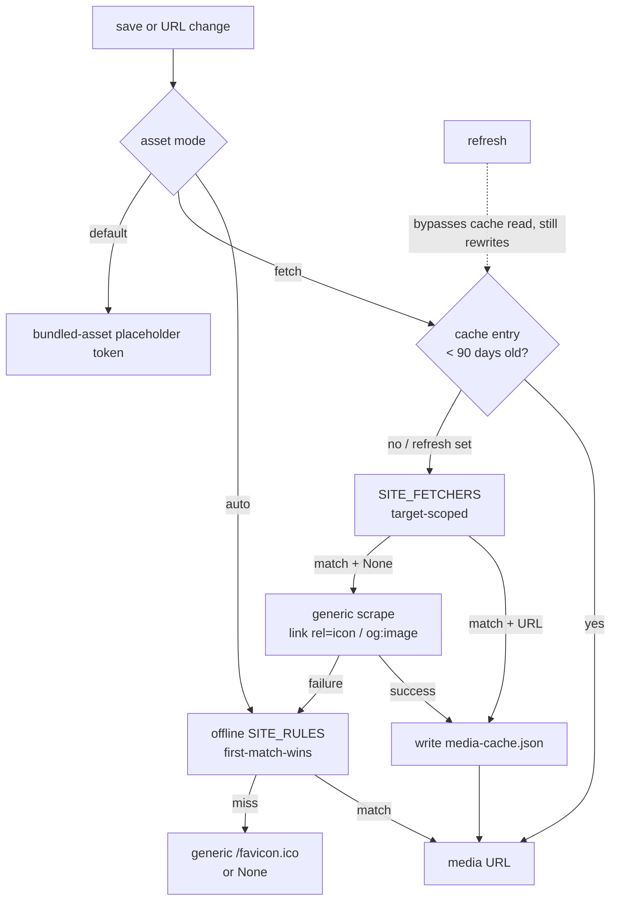

# waypoint — Dev In Depth

This is the authoritative implementation map. It describes the **current**
architecture: a library crate (`src/lib.rs`) whose layered modules the thin
`src/main.rs` binary shells over. The older `src/db/`, `src/cli/`,
`src/server/`, and flat-subcommand layout described by earlier drafts is gone;
treat those names as mapping to `database`, `cmd`, and `http` below.

Companion docs: `README.md` (CLI/API surface + "What I changed from the
original design doc"), `ROUGH_IDEA.md` (original design spec), `AGENTS.md`
(short operational notes, including gotchas).

---

## 1. The whole tree

```
Cargo.toml
src/
├── main.rs            thin binary shell: parse, log-init, dispatch
├── lib.rs             declares the modules in layer order
├── config.rs          shared defaults (db path, host, port, limits)
├── model.rs           pure structs + constants (no I/O, no SQL)
├── shared.rs          validation helpers + size caps (no I/O)
├── database/          SQLite: open, versioned migrations, legacy seam
│   ├── mod.rs             open() + legacy upgrade
│   ├── migrations.rs      MIGRATIONS array + apply()
│   ├── migrations/        0001_init.up.sql
│   ├── bookmarks.rs       CRUD + filters + FTS queries
│   ├── tags.rs            tag CRUD + link/unlink
│   ├── categories.rs      category CRUD
│   ├── visits.rs          visit recording + top/never stats
│   ├── stats.rs           aggregate queries
│   └── tests.rs           in-crate database tests
├── core/              shared business rules used by CLI *and* HTTP
│   ├── mod.rs             media dispatch entry points
│   ├── media.rs           table-driven favicon/thumbnail resolver + dispatcher
│   ├── cache.rs           persistent cache of fetched-media results (90-day TTL)
│   ├── sites/             site-specific media rules and network fetchers
│   │   ├── mod.rs             SITE_RULES + SITE_FETCHERS master tables
│   │   └── youtube.rs         YouTube offline rules (ROWS) + avatar fetcher
│   ├── fetch/             generic network engine (icon/og-image scrape, HTML fetch)
│   │   └── mod.rs
│   ├── url.rs             URL sanity/format helpers
│   ├── import_export.rs   HTML/Markdown/CSV import and export
│   └── checker.rs         link-liveness checker
├── cmd/               grouped clap CLI + dispatch
│   ├── mod.rs             Cli, Command, run_command()
│   ├── bookmarks.rs       add|list|get|update|remove|open|search|import|export
│   ├── tags.rs            list|rename|delete
│   ├── categories.rs      list|rename|delete
│   ├── trash.rs           list|restore|empty
│   ├── stats.rs           overview|domains|tags|ids|keywords|top-visited|never-visited|orphan-tags|hygiene|activity
│   ├── check.rs           report + export (dead-link report)
│   └── output.rs          shared table/JSON printing
├── http/              axum server
│   ├── mod.rs             run() + app() + host/port validators
│   ├── auth.rs            optional bearer-token gate
│   ├── error.rs           anyhow::Error → JSON error mapping
│   ├── docs.rs            utoipa ApiDoc
│   └── handlers/mod.rs    24 REST handlers + keyword list/redirect + static fallback
└── logging/           macros + init + format plumbing
frontend/              embedded SPA (index.html, app.js, style.css, favicon.ico)
tests/
├── cli_smoke.rs       end-to-end CLI scenarios on a temp DB
└── http_api.rs        oneshot HTTP tests against app(state)
```

Dependency direction is enforced by module visibility, not a tool: `model` and
`shared` import nothing from the project; `database` imports `model`/`shared`;
`core` imports `model`/`shared`/`database`; `cmd` and `http` both import
`core` + `database` + `logging` — the shared seam that keeps CLI and API
behavior identical.

---

## 2. Foundation — `Cargo.toml`

Rust 2024 edition (rustc ≥ 1.85), single library + single binary. The lib is
not published; it exists so `cmd` and `http` and the integration tests share
one crate. Notable dependency decisions:

- **`rusqlite`** with the `bundled` feature — no system SQLite required. FTS5
  support is enabled on the connection at open time.
- **`axum` 0.8** (path params use `{id}` syntax) on **`tokio`** 1
  (`rt-multi-thread`, `macros`, `net`, `fs`). `utoipa`'s derive feature
  flag is **`macros`**, not `derive` — that crate has no `derive` feature and
  the typo produces a confusing compile error.
- **`utoipa` `5`** with the `macros` feature. No `utoipa-swagger-ui`: the
  vendored UI embedded ~5MB of assets into the release binary, so it was
  dropped — the raw spec at `/api/openapi.json` remains for external tooling.
- **`rust-embed`** embeds `frontend/` for release builds; debug builds can
  serve a live directory instead (see §7).
- `clap` 4 (`derive`, `env`) — CLI parsing; `serde` + `serde_json` —
  request/response shapes; `bytes` — zero-copy static assets; `anyhow` —
  error plumbing; `subtle` — constant-time token compare; `mime_guess` —
  static-asset MIME types; `regex` — Netscape HTML import; `ureq` —
  synchronous rustls-based HTTP client shared by `core::fetch` (scraping)
  and `core::checker` (dead-link probes); `open` — cross-platform browser
  launch for `bookmarks open`; `dirs` — platform cache dir for the
  fetched-media cache. `chrono` is optional, pulled in only by the
  `show_time_stamp` feature. Dev-deps: `tempfile` (temp-dir databases in
  tests), `tower` (`ServiceExt::oneshot` request injection), `http-body-util`
  (response body reads).

---

## 3. Layer 0 — `model` + `shared`

### `model.rs`

Pure data types — no SQL, no I/O, no domain logic. These are the shapes that
cross boundaries (database → cmd/http, and database → frontend via JSON).
Highlights:

- `Bookmark` — the full row: id, title, url, description, domain, category_id,
  starred, keyword, note, favicon, thumbnail, visit_count, last_visited_at,
  is_archived, trashed_at, created_at, updated_at.
- `NewBookmark` / `UpdateBookmark` — the write shapes. `UpdateBookmark` is a
  **tri-state** type: `Option<Option<String>>`-style fields where `None` means
  "leave unchanged" and `Some("")` means "clear this field" (used for e.g.
  clearing a keyword). `tags` (full replace) vs `add_tags`/`remove_tags` live
  here too.
- `BookmarkFilter` — one struct for all listing: `category`, `tag`, `starred`,
  `archived: Option<bool>`, `trash`, `limit`, `offset`. Shared by `list` and
  `count` (see gotcha below).
- Stats shapes (`StatsOverview`, `DomainVisitStats`, `MonthlyActivity`,
  `OrphanTag`, `HygieneStats`, `NeverVisitedBookmark`, …).
- `DEFAULT_CATEGORY = "Uncategorized"` — seeded by `database::open` on every
  fresh (and legacy-upgraded) database.

### `shared.rs`

Stateless helpers both front doors use, so one rule can't drift between CLI
and HTTP:

- `extract_domain` — naive-but-stable domain extraction for the `domain`
  column (no `url` crate dependency).
- Size caps: `MAX_PAGE_SIZE = 1000`, `MAX_QUERY_ROWS = 100_000`.
- `validate_limit` / `validate_offset` / `validate_id` — return `Result<_, String>`
  and clamp/validate the same way everywhere.
- `is_valid_keyword` — the one place a keyword's shape is decided.

---

## 4. Layer 1 — `database`

One `rusqlite::Connection`, wrapped in a `Mutex` by the callers. The CLI owns
it outright; the HTTP server keeps it in `AppState` and only touches it inside
`tokio::task::spawn_blocking`. No pool, no sharing the connection across tasks
directly — this is a personal, low-traffic tool.

### `open()` — the only entry point

`database::open(path)` is the sole way a connection is made. It always:

1. Opens (creating if needed) the SQLite file and sets `PRAGMA foreign_keys`
   **before** any transaction starts (it's a no-op inside one).
2. Runs `migrations::apply` (see below), which upgrades a legacy database in
   place along the way.
3. Seeds the default `Uncategorized` category if absent.

### Versioned migrations — forward-only, tracked

Contrast with the old design, where one big `migrations/001_initial.sql`
re-ran on **every** startup. Now:

- `schema_migrations(version, name, applied_at)` records what has run. Fresh
  databases get version 1 from migration 0001.
- `MIGRATIONS` in `migrations.rs` is a static array; each entry is a version,
  a name, and the SQL `include_str!`'d from `migrations/NNNN_name.up.sql`.
- `apply()` runs every pending migration in its **own transaction** — a
  failure rolls back that migration's batch but leaves earlier versions
  applied. Adding a migration is exactly two edits: one new
  `NNNN_name.up.sql` file + one `MIGRATIONS` entry. Nothing else changes
  anywhere.

Migration 0001 is deliberately written **idempotent** (`CREATE ... IF NOT
EXISTS`, `DROP INDEX IF EXISTS`): legacy databases run through the same batch,
so one SQL file has to be safe for both the fresh and the upgrade path.

### The schema, briefly

- `categories(id, name UNIQUE)` — `DEFAULT_CATEGORY` seeded at open.
- `bookmarks(id, title, url, description, domain, category_id → categories
  ON DELETE CASCADE, starred, keyword, note, favicon, thumbnail, visit_count,
  last_visited_at, is_archived, trashed_at, created_at, updated_at)`.
  Recycle bin = `trashed_at IS NULL` (active) vs non-NULL (trashed).
- `tags(id, name UNIQUE)` + junction `bookmark_tags(bookmark_id, tag_id)`.
- **Partial unique indexes** — `idx_bookmarks_url_active` and
  `idx_bookmarks_keyword_active` are unique _only where `trashed_at IS NULL`_,
  so a trashed bookmark never blocks re-adding the same URL or keyword. To
  stop the delete → re-add → delete cycle stacking stale copies, the trash
  paths (`trash`, `remove_ids`, `remove_matching`) purge any older trashed
  row with the same URL first (`trash_with_dedup`) — the trash holds at most
  one copy per URL, and `restore` refuses to resurrect a copy whose URL a
  live row already owns (friendly "URL already exists" error → HTTP 409).
- `update_bookmark_timestamp` trigger, column-scoped (`AFTER UPDATE OF
  title, url, description, ...`) so visit-tracking writes (`visit_count`,
  `last_visited_at`) don't bump `updated_at`.

### Full-text search — two mirrored indexes

The search design is the subtlest part of the schema:

- `bookmarks_fts` (active) and `bookmarks_fts_archived` (archived) are two
  FTS5 virtual tables over the same `bookmarks` content (external-content, so
  data isn't duplicated). Trashed content lives in **neither** index.
- 12 column-scoped triggers keep them in sync: insert/delete/update by
  `is_archived` and `trashed_at` state, plus `bookmarks_fts_archive` /
  `_unarchive` toggle triggers and `_trash` / `_restore` triggers.
- The content-edit update triggers carry `OLD.is_archived == NEW.is_archived`
  guards so `update --archive` (which rewrites the whole row in one UPDATE,
  firing update + toggle triggers together) can't fight the toggle triggers —
  only the toggle triggers act during a move.
- `search` / `/api/search` hit the main index by default; `--archived` /
  `?archived=true` hit the archive index. Trash is quarantined at the raw
  index level.

### The legacy database seam

A "legacy" database is one written by pre-versioned waypoint builds: it
already has `bookmarks` but no `schema_migrations`. `open()` detects this and
runs two extra passes:

- **`legacy_preclean`** — runs _before_ migration 0001. Drops the 13 old FTS
  triggers (`DROP TRIGGER IF EXISTS bookmarks_fts_soft_delete;` etc. — a plain
  `CREATE TRIGGER IF NOT EXISTS` would leave old unguarded definitions in
  place, and `ALTER TABLE ... RENAME COLUMN` refuses to rewrite a trigger
  whose body writes into an FTS5 table). Renames `deleted_at` → `trashed_at`,
  drops the dead `mime_type` column.
- **`legacy_postclean`** — runs _after_ migration 0001. Repairs search-index
  state the old triggers let rot: scrubs stale trashed rows out of the main
  index (via the FTS5 special `delete` command, which needs the exact indexed
  content), and rebuilds both indexes if archived rows leaked into the main
  one.

### Submodule responsibilities

- `bookmarks.rs` — insert/get/update/remove (trash vs `--purge`)/restore,
  `list` (via `BookmarkFilter`), `count` (see gotcha), search queries,
  keyword lookup.
- `tags.rs`, `categories.rs` — CRUD plus bookmark↔tag link/unlink.
- `visits.rs` — `record_visit` (fire-and-forget from the keyword redirect) and
  the top-visited / never-visited / domain stats.
- `stats.rs` — aggregate queries (overview, activity by month, orphan tags,
  hygiene, duplicates).
- `tests.rs` — in-crate tests (migrations, legacy upgrade, duplicate rules).

---

## 5. Layer 2 — `core` (shared business rules)

The seam that keeps CLI and HTTP behavior identical: `cmd` and `http` both
call into `core` + `database`, never each other.

### `media.rs` — table-driven favicon/thumbnail resolver + dispatcher

`media.rs` is the entry point for every favicon/thumbnail decision; both
CLI and HTTP reach it through `database::bookmarks` (insert and
URL-change recompute). It dispatches through **two** tables, both living
in `core/sites/mod.rs`:

1. **`SITE_RULES`** — the offline, first-match-wins table used by the `Auto`
   asset mode (`media::favicon` / `media::thumbnail`). Zero network I/O.
2. **`SITE_FETCHERS`** — network-assisted, per-site extractors used by the
   `Fetch` asset mode (`media::fetch_favicon` / `media::fetch_thumbnail`).
   Each `SiteFetcher` carries a `target: MediaTarget`, so favicon and
   thumbnail fetchers live in one table but are dispatched target-scoped.

The resolution order for `media::fetch_favicon` is:

1. Iterate `SITE_FETCHERS` entries with `target == Favicon`; the first whose
   `matches(url)` is true and whose `fetch(url)` returns a URL wins. A
   matching fetcher that produces `None` (fetch/extraction failed) falls
   through.
2. Otherwise run the generic `<link rel=icon>` scrape in `core::fetch`
   (`super::fetch::fetch_favicon`).
3. Otherwise fall back to the offline rule table's `favicon(url)`, whose
   last resort is `{scheme}://{host}/favicon.ico`.

`media::fetch_thumbnail` follows the same shape, but dispatches only
`SITE_FETCHERS` entries with `target == Thumbnail`, then the generic
`og:image` scrape, then the offline `thumbnail()` table. Favicon and
thumbnail fetchers therefore resolve independently of each other.

Both `fetch_favicon` and `fetch_thumbnail` sit in front of `core::cache`:
a successful network result (site fetcher _or_ generic scrape) is stored
keyed by the bookmark URL + `MediaTarget`, and a live entry short-circuits
the fetch. Only genuine network successes are cached — the offline
rule-table fallback and any `None` result are never stored, so a failed
fetch is retried next time and a rule-table edit isn't pinned by a stale
entry. Entries expire after a 90-day TTL; `update --refresh` (and the HTTP
`refresh: true` body field) bypasses the cache read via the
`fetch_favicon_fresh` / `fetch_thumbnail_fresh` entry points, re-scraping
now and rewriting the cache with the fresh result. See `core/cache.rs`.

The full resolution pipeline, per `MediaTarget`:



A `SiteRule` is a host suffix, an optional path prefix, a `MediaTarget`
(`Favicon` or `Thumbnail`), and an extractor function.

- Matching is **host suffix + optional path prefix** — deliberately not raw
  substring matching, so `https://evil.example/...youtube.com/watch...` can
  never false-match a YouTube rule. Hosts are compared case-insensitively,
  suffix-only (`www.youtube.com` matches `youtube.com`; `youtube.com.evil.example`
  does not).
- `Favicon` and `Thumbnail` resolve **independently**: the first matching rule
  of _that target_ wins. `favicon(url)` falls through to the generic
  `{scheme}://{host}/favicon.ico` last resort; `thumbnail(url)` stays `None`
  for everything without a matching rule — most bookmarks simply have no
  thumbnail.
- The offline table is synchronous and string-only: **no network I/O**, no
  per-site error plumbing. A rule produces a URL or `None`, and resolution
  falls through. The `Fetch` path is the only one that touches the network,
  and it is deliberately best-effort (see `core::fetch` below).

### `cache.rs` — fetched-media result cache

`core/cache.rs` stores the _outcomes_ of the network fetch paths above so a
page's favicon/thumbnail are fetched at most once per TTL instead of on
every save. It is media-specific by design: the link checker (`core::checker`)
probes are always live and never cached.

- **Key** — bookmark URL + `MediaTarget`; the two targets are separate
  maps in the JSON, so favicon and thumbnail resolve independently and an
  `evict(url)` drops both at once.
- **Location** — `$WAYPOINT_CACHE_DIR` if set, else the platform cache dir
  (`dirs::cache_dir`: `~/.cache` on Linux, `~/Library/Caches` on macOS,
  `%LOCALAPPDATA%` on Windows), else the temp dir. File:
  `<cache_dir>/waypoint/media-cache.json`. Tests run against a per-process
  temp dir and never touch the real cache.
- **Rules** — only successful network results are cached (`None` and the
  offline rule-table fallback are not); entries expire after a 90-day TTL;
  the file is capped at ~10k entries (oldest dropped); writes are atomic
  (temp file + rename); a corrupt or version-mismatched file is logged and
  treated as empty.
- **`update --refresh`** — bypasses the cache read for one bookmark via
  `media::fetch_favicon_fresh` / `media::fetch_thumbnail_fresh`; the fresh
  result still rewrites the cache entry. The HTTP PATCH body accepts the
  same `refresh: true` (`UpdateBookmark.refresh`, `#[serde(default)]`).

### The media extension rule

Adding a site never touches `media.rs`, `core::fetch`, or the database:

1. Create `core/sites/<site>.rs` with the extractor functions plus a `ROWS`
   slice. Each `SiteRule` carries `examples` — (URL, expected) pairs that
   double as documentation **and** as the table-driven test's input, so a new
   row can't land without proof.
2. If the site's real media hides in page JSON (e.g. a YouTube channel
   avatar in `ytInitialData`), add a `matches(url) -> bool` predicate and a
   `fetch(url) -> Option<String>` extractor that reads the page via
   `super::super::fetch::fetch_html_limited`.
3. Register it in `core/sites/mod.rs`: `pub mod <site>;` + one entry in
   `SITE_RULES`, plus one `SiteFetcher` entry in `SITE_FETCHERS` (with the
   right `target: MediaTarget::Favicon` / `Thumbnail`) when step 2 applies.

That's the whole integration. Matching, first-match-wins, fallback, the
generic scrape, and the table-driven tests all pick the new rows up
automatically.

### `fetch.rs` — generic network engine

`core::fetch/mod.rs` is deliberately **site-agnostic**: it owns the ureq
agent, the 5s timeout / 5-redirect / 512 KB caps, the HTTP(S)-only guard,
and the generic `<link rel=icon>` + `og:image` extractors
(`fetch_favicon`, `fetch_thumbnail`). Its one site-facing seam is
`fetch_html_limited(url, budget, ua)` (`pub(crate)`), which the per-site
fetchers in `core::sites` use when a generic scrape can't reach the media
URL (a YouTube channel avatar needs a Chrome `User-Agent` and a 4 MB body
budget to reach `ytInitialData`). `core::sites` imports this seam; the
engine never imports back from `core::sites`.

### `url.rs`

Sanity/format helpers for `url` and `keyword` used by both front doors before
anything touches the database.

### `import_export.rs`

HTML (browser-bookmarks export format), Markdown (link lists), and CSV import
and export. The CLI `bookmarks import`/`export` maps onto this; `export` also
supports the Markdown/CSV formats.

### `checker.rs`

Link-liveness checker. Fetches each bookmarked URL (with `ureq` — synchronous,
rustls-based, so it fits the sync CLI path without an async runtime), classifies
the result (reachable / dead / redirected / error), and returns a report the
CLI `check` command prints and can optionally feed back into `remove`. Bare
`waypoint check` runs it in report-only mode; `--delete` moves dead links to
trash; `--hard-delete` purges them; `--jobs N` sets concurrency.

---

## 6. Layer 3a — CLI (`cmd`)

Grouped subcommands, clap 4 derive. `main.rs` is a thin shell: parse
`waypoint::cmd::Cli`, init logging, then dispatch `serve` to the async
`waypoint::http::run()` and everything else to `waypoint::cmd::run_command()`.

`run_command` opens its **own** `database::open` connection — these are
short-lived, one-shot CLI invocations, so sharing the server's connection
makes no sense.

### Global options

`-D/--database` (`WAYPOINT_DB_FILE`), `-L/--log-level`, `-F/--log-format`
(default pretty), `--log-file` — all `global = true`.

### The command tree

- `serve` — `-H/--host` (`WAYPOINT_SERVE_HOST`, default `localhost`),
  `-p/--port` (`WAYPOINT_SERVE_PORT`, default 8080), `--api-token`
  (`WAYPOINT_SERVE_TOKEN`), and — **debug builds only** — `--static-dir` to
  serve live frontend files. A release binary has no `--static-dir` flag;
  `main.rs` `#[cfg]`s on it and always passes `None` there.
- `bookmarks add|list|get|update|remove|open|search|import|export`
- `tags list|rename|delete`
- `categories list|rename|delete`
- `trash list|restore` — bare `waypoint trash` lists the recycle bin
- `stats overview|domains|tags|ids|keywords|top-visited|never-visited|orphan-tags|hygiene|activity` — bare `waypoint stats` shows the overview
- `check [--delete|-d | --hard-delete|-x] [--jobs|-j N] [export]` — bare
  `waypoint check` runs report-only

### The clap gotcha that shaped the design

Required subcommand groups (`Bookmarks(...)`, `Tags(...)`, `Categories(...)`)
are **tuple variants** (`#[command(subcommand)] Bookmarks(bookmarks::Command)`).
Optional subcommand groups (`Trash { command: Option<...> }`, `Stats { ... }`,
`Check { ... }`) **must be struct variants** — clap 4 does not implement
`FromArgMatches`/`Subcommand` for `Option<T>` in a tuple position, which was a
compile error. All three optional groups also set
`#[command(disable_help_subcommand = true)]`.

### `output.rs`

Shared printing: a simple table renderer and JSON output (`--json`), so CLI
and scripted consumers get consistent shapes.

---

## 7. Layer 3b — HTTP server (`http`)

axum 0.8. `run()` validates the host (literal IPv4/IPv6 or RFC 1123 hostname,
rejecting anything else) and port (rejects 0) before ever creating a listener,
then binds and serves. `app()` builds the full `Router` from an `AppState` and
is split out so integration tests can inject requests directly via
`tower::ServiceExt::oneshot` without binding a port.

### State and concurrency

`AppState { db: Arc<Mutex<Connection>>, static_dir: Option<PathBuf>, api_token: Option<String> }`.
One connection serialized behind a lock, touched only inside
`tokio::task::spawn_blocking`.

### Routing

```
GET  /keywords                     plain-text keyword list (no auth)
GET  /keywords/{keyword}           307 redirect + fire-and-forget visit record
/api/bookmarks          GET POST
/api/bookmarks/{id}     GET PUT DELETE
/api/bookmarks/{id}/restore        POST
/api/categories         GET
/api/categories/{id}    PUT DELETE
/api/tags               GET
/api/tags/{name}        PUT DELETE
/api/search             GET
/api/stats              GET
/api/stats/domains|tags|top-visited|never-visited|orphan-tags|hygiene|activity  GET
/api/stats/bookmarks/{id}          GET
/api/openapi.json            GET   raw OpenAPI spec (utoipa), same auth gate
fallback                            static frontend (embedded or --static-dir)
```

### Auth

- No token configured → fully open.
- Token set → `/api/*` and `/api/openapi.json` require
  `Authorization: Bearer <token>`. Comparison is constant-time (`subtle`).
  401 sends `WWW-Authenticate: Bearer`.
- The `/keywords` redirects are **public by design** — they're meant to work
  as URL shortcuts.

### Error mapping — `error.rs`

Every error response is `{ "error": <message>, "code": <stable code> }`. The
`From<anyhow::Error>` impl:

1. Special-cases the friendly duplicate-URL message from
   `database::bookmarks::insert` ("URL already exists as bookmark #…") → 409
   `conflict_url`.
2. Otherwise inspects the SQLite error: `extended_code == 2067` (UNIQUE)
   on `bookmarks.keyword` → 409 `conflict_keyword`, else 409 `conflict_url`.
3. Validation failures from `shared::validate_*` → 400 with the matching
   `invalid_*` code; missing rows → 404 `not_found`; `/api/search` without `q`
   → 400 `query_required`.
4. Everything else is logged with `{:#}` and becomes a generic 500
   `internal_error`.

`ErrorCode` is an enum whose `as_str()` produces the wire codes, so the
string can never drift from the documented values.

### `handlers/mod.rs`

24 REST handlers (bookmarks/categories/tags/search/stats) plus the
`/keywords` list and redirect pair and the static fallback, each with
utoipa path/response annotations. List responses carry the **lowercase**
`x-total-count` header — axum 0.8 does not normalize header names, so a
capitalized `X-Total-Count` would silently become a second, ignored header.

---

## 8. Layer 4 — Frontend (`frontend/`)

Embedded with `rust-embed` in release builds; served from a live directory in
debug builds via `serve --static-dir`. The `static_handler` fallback serves
the SPA, so client-side routes work on refresh.

- `index.html` — single-page shell.
- `app.js` — vanilla JS state, `loadAll()`, rendering, and the API client.
- `style.css` — the design system, including the `.card-thumb` thumbnail block
  (96px, `object-fit: cover`, `loading="lazy"`) rendered when `bookmark.thumbnail`
  is set.
- `favicon.ico`.

Key behaviors:

- **Token prompt is deduplicated**: the first 401 triggers one `window.prompt`
  stored in a module-level `tokenPrompt` variable; parallel 401s from
  `Promise.all` in `loadAll()` share it. The token is persisted in
  `localStorage` under `waypoint_token` and sent as `Authorization: Bearer` on
  every subsequent request.
- The keyword tri-state contract is mirrored client-side: an empty keyword is
  treated as "no keyword", a set one as "use this shortcut".

---

## 9. Cross-cutting — logging

`src/logging/` provides:

- Level and format enums (`LogLevel`, `LogFormat`) shared by CLI and server.
- `log_init(file, level, format)` — configures output; called once from
  `main.rs`. Default level is `warn`, or `info` while serving.
- `#[macro_export]`ed macros (`log_trace!`, `log_debug!`, `log_info!`,
  `log_warn!`, `log_error!`) exported from the **lib** — `main.rs` and the
  modules must call them as `waypoint::log_debug!(...)`, not
  `crate::log_debug!(...)`.

Deliberate dead code (present, unused, clippy warns, keep them):
`next_request_id`, `log_set_level`/`log_get_level`, `log_use_color`,
`truncate_for_log`.

---

## 10. Cross-cutting — concurrency model

- One SQLite connection, owned outright by the CLI, or wrapped in a `Mutex`
  in `AppState` for the server. All DB access on the server side happens
  inside `spawn_blocking`.
- The keyword redirect records the visit **fire-and-forget**: it fires a
  `spawn_blocking` task and returns the 307 immediately — the visit write must
  never delay the redirect.
- The `checker` is the only place that does real network concurrency, bounded
  by `--jobs`.

---

## 11. End-to-end traces

### Adding a bookmark via the CLI

`waypoint bookmarks add <url>` → `main` parses → `run_command` opens the DB →
`cmd::bookmarks::add` validates the URL → `database::bookmarks::insert`
(pre-checking for a duplicate URL, bailing with the friendly message) →
media resolution fills `favicon`/`thumbnail` via `core::media` (synchronous,
no network) → FTS triggers index the row → table print.

### Adding a bookmark via the web UI

Frontend POSTs to `/api/bookmarks` → `auth` gate (token?) → handler parses →
same `database::bookmarks::insert` → JSON response with the created bookmark.
Duplicate URL → the friendly message → 409 `conflict_url`.

### Visiting a keyword shortcut

`GET /keywords/foo` → public, no auth → handler looks up the bookmark by
keyword → 307 `Redirect` to its URL, and a `spawn_blocking` task records the
visit → next `stats top-visited` reflects it. Missing keyword → 404 JSON.

### Searching

`/api/search?q=...` (or `waypoint bookmarks search`) → validates `q` (missing
→ 400 `query_required`) → FTS query against the main index (archive index with
`?archived=true`) → results + `x-total-count`.

---

## 12. File map

| Path                                                       | Role                                                       |
| ---------------------------------------------------------- | ---------------------------------------------------------- |
| `src/main.rs`                                              | thin shell: parse, log-init, dispatch serve vs run_command |
| `src/lib.rs`                                               | module declarations, layer order, crate docs               |
| `src/config.rs`                                            | shared defaults (db path, host, port, list/search limits)  |
| `src/shared.rs`                                            | validation + caps + domain extraction                      |
| `src/model.rs`                                             | pure structs + `DEFAULT_CATEGORY`                          |
| `src/database/mod.rs`                                      | `open()`, legacy pre/postclean, `#![doc]` on conn policy   |
| `src/database/migrations.rs`                               | `MIGRATIONS` array, `apply()`, `current_version()`         |
| `src/database/migrations/0001_init.up.sql`                 | idempotent full schema                                     |
| `src/database/{bookmarks,tags,categories,visits,stats}.rs` | SQL per area                                               |
| `src/database/tests.rs`                                    | in-crate DB tests                                          |
| `src/core/media.rs`                                        | resolver + dispatcher (favicon/thumbnail)                  |
| `src/core/cache.rs`                                        | fetched-media result cache (platform dir, 90-day TTL)       |
| `src/core/sites/{mod,youtube}.rs`                          | `SITE_RULES` + `SITE_FETCHERS` tables, YouTube             |
| `src/core/fetch/mod.rs`                                    | generic network engine (scrape, `fetch_html_limited`)      |
| `src/core/url.rs`                                          | URL/keyword helpers                                        |
| `src/core/import_export.rs`                                | HTML/Markdown/CSV                                          |
| `src/core/checker.rs`                                      | link-liveness                                              |
| `src/cmd/mod.rs`                                           | `Cli`, `Command`, `run_command`                            |
| `src/cmd/{bookmarks,tags,categories,trash,stats,check}.rs` | handlers                                                   |
| `src/cmd/output.rs`                                        | table/JSON printing                                        |
| `src/http/mod.rs`                                          | `run()`, `app()`, validators, router                       |
| `src/http/auth.rs`                                         | bearer gate                                                |
| `src/http/error.rs`                                        | error → JSON mapping + `ErrorCode`                         |
| `src/http/docs.rs`                                         | utoipa `ApiDoc`                                            |
| `src/http/handlers/mod.rs`                                 | handlers + utoipa annotations                              |
| `src/logging/`                                             | init + macros + format plumbing                            |
| `frontend/`                                                | SPA (index.html, app.js, style.css)                        |
| `tests/cli_smoke.rs`                                       | CLI end-to-end scenarios                                   |
| `tests/http_api.rs`                                        | oneshot HTTP tests                                         |

---

## 13. If you're extending this next

- **Add a site to the media engine**: create `core/sites/<site>.rs` (extractor
  fns + `ROWS` slice with `examples`), register in `core/sites/mod.rs`
  (`SITE_RULES`, plus a `SITE_FETCHERS` entry tagged with the right
  `MediaTarget` when the site needs a network fetch). That's it — resolver,
  fallbacks, generic scrape, and table-driven tests pick it up.
- **Add a migration**: write `src/database/migrations/0001...`-style
  `NNNN_name.up.sql` (keep it idempotent for the legacy path) and add one
  `MIGRATIONS` entry. Nothing else.
- **Add a CLI subcommand**: extend the right enum in `src/cmd/<area>.rs` and
  its `run` match; re-use `output.rs` for printing. If the new group should be
  optional at the top level, use a **struct variant** + `disable_help_subcommand`.
- **Add an API endpoint**: add the handler in `src/http/handlers/mod.rs` (with
  utoipa annotations), a route in `src/http/mod.rs`, and consider a
  `tests/http_api.rs` oneshot test. Mirror the CLI via `database` — both should
  call the same query, never re-implement SQL.
- **Keep `list` and `count` in lockstep**: any change to `BookmarkFilter` →
  SQL in `list` must be replicated in `count`, or `x-total-count` drifts from
  the array length.
- **Keep duplicate detection in sync**: the friendly duplicate message in
  `database::bookmarks::insert` and the `conflict_url` special-case in
  `http::error.rs` are two halves of one contract — change one, change both.
- **Run the full gate**: `cargo fmt --check` (hard tabs), `cargo clippy
  --all-targets`, `cargo test`, and `node --check frontend/app.js` if you
  touched the frontend.
