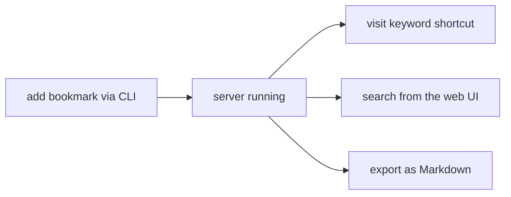

<h1 align="center">
	<br>
	
	<br>
	📚 Waypoint
	<br>
	<br>
</h1>

A modern, self-hosted bookmark manager: a single Rust binary with a
SQLite database, a CLI, an HTTP API, and a small embedded web frontend.
No external services, no build step for the frontend.

Its two headline features are **keyword shortcuts** — save a bookmark
with `-k yt`, then visit `http://localhost:8080/keywords/yt` to jump
straight there — and **full-text search** across titles, descriptions,
notes, and URLs.

## Table of contents

- [Features](#features)
- [Platform support](#platform-support)
- [Install](#install)
- [Quickstart](#quickstart)
- [CLI reference](#cli-reference)
- [Environment variables](#environment-variables)
- [Configuration](#configuration)
- [HTTP API](#http-api)
- [License](#license)
- [Contributing](#contributing)

## Features

- **Keyword shortcuts** — give a bookmark a `-k yt` and `/keywords/yt`
  redirects straight to it, logging a visit each time.
- **Full-text search** — fast FTS5 search across titles, descriptions,
  notes, and URLs.
- **Organized** — categories, tags, starring, and archiving.
- **Media on autopilot** — favicons and thumbnails resolve at save time with
  a per-asset mode: `auto` (derive from the URL), `fetch` (scrape the page
   for its real icon/og-image), or `default` (a bundled placeholder served
   from the local binary). Successful `fetch` results are cached on disk for
   90 days (`update --refresh` re-fetches on demand).
- **Bulk remove by criteria** — trash (or permanently purge) every bookmark
  matching a category, tag, keyword shortcut, or time range, from the CLI or
  the web UI — with a dry-run preview before anything happens.
- **Three front doors, one database** — a CLI, an HTTP API, and a web UI
  that all read and write the same SQLite file.
- **Stats and analytics** — usage dashboards: most-visited domains,
  never-visited bookmarks, orphan tags, hygiene scores, monthly activity.
- **Import / export** — Netscape HTML import from any browser, and
  Markdown or CSV export.
- **Dead-link checker** — `waypoint check` probes every bookmark and
  reports (and optionally removes) sites that no longer resolve.
- **Single binary** — the frontend is embedded via `rust-embed`, so you
  ship one file.

Once a feature above catches your eye, the rest of this README follows
the order you'd actually use it in: check the platform requirements,
install the binary, run the quickstart, then dip into the reference
sections as needed.

## Platform support

Runs anywhere a Rust 2024-edition toolchain (rustc >= 1.85) produces a
binary — Linux, macOS, Windows, and more. SQLite is bundled via
`rusqlite`'s `bundled` feature, so there's no system SQLite dependency
and FTS5 is always available.

## Install

Requires a Rust 2024-edition toolchain (rustc >= 1.85).

```
cargo build --release
./target/release/waypoint serve
```

The release binary has the frontend embedded — copy it anywhere and run
it, no `frontend/dist/` directory needed.

For frontend iteration without rebuilding the binary each time:

```
cd frontend && bun run build
cd .. && cargo run -- serve --static-dir frontend/dist/
```

`--static-dir` only exists in debug builds (a release binary has no such
flag and always serves the embedded copy).

## Quickstart

With the binary installed, here's the shortest path from zero to a
working bookmark:

```
# Start the web UI
waypoint serve                      # http://localhost:8080

# Add a bookmark from the CLI
waypoint bookmarks add https://youtube.com --keyword yt --category Media --tags video,fun

# Jump straight to it (records a visit)
open http://localhost:8080/keywords/yt

# Find it again
waypoint bookmarks search "youtube"

# See what you've logged
waypoint bookmarks list

# Check your stats
waypoint stats
```

Or, step by step, the same idea from `add` to `export`:



1. `waypoint bookmarks add https://rust-lang.org -k rust --tags lang`
2. `waypoint serve`
3. Visit `http://localhost:8080/keywords/rust` — instant redirect.
4. Search "rust" from the UI or `waypoint bookmarks search rust`.
5. `waypoint bookmarks export bookmarks.md --format md`

## CLI reference

### Bookmarks

```
waypoint bookmarks add <url> [options]
    --title T               bookmark title (defaults to domain)
    --keyword K             shortcut word -> /keywords/K redirects here
    --category C            which category (default: Uncategorized)
    --tags a,b,c            comma-separated tags
    --description D         free-text description
    --note N                personal note
    --favicon URL           custom favicon URL (mutually exclusive with
                            --thumbnail, --no-custom-favicon, --no-thumbnail)
    --thumbnail URL         thumbnail image URL (mutually exclusive with
                            --favicon, --no-custom-favicon, --no-thumbnail)
    --no-custom-favicon     use only the generic domain favicon, not a site-specific one
                            (mutually exclusive with --favicon/--thumbnail/--no-thumbnail)
    --no-thumbnail          don't auto-add a thumbnail (e.g. YouTube video thumbnails)
                            (mutually exclusive with --favicon/--thumbnail/--no-custom-favicon)
    --mode auto|fetch|default
                            how to resolve favicon + thumbnail when no explicit
                            URL is given: derive from the URL (auto, default),
                            scrape the page now (fetch), or use the bundled
                            placeholder (default)
    --starred               star on creation

waypoint bookmarks update <id>... [options]
    --title T --url U --keyword K --category C --tags a,b,c
    --description D --note N --favicon URL --thumbnail URL
    --no-custom-favicon     reset favicon to the generic domain favicon
                            (mutually exclusive with --favicon/--thumbnail/--no-thumbnail)
    --no-thumbnail          clear the thumbnail
                            (mutually exclusive with --favicon/--thumbnail/--no-custom-favicon)
    --mode auto|fetch|default
                            re-resolve favicon + thumbnail the given way
    --refresh               re-fetch favicon + thumbnail from the page now,
                            bypassing the fetched-media cache (90-day TTL)
    --star / --unstar
    --archive / --unarchive
    --clear-keyword

waypoint bookmarks remove [<id>...] [options]
    # moves to trash by default; --purge deletes for good
    --purge                 delete for good instead of trashing
    --dry-run               preview matching ids/count, change nothing
    # either ids, or one or more criteria (never a bare catch-all):
    --category C --category-id N --tag T --keyword K
    --created-after/--before D   --updated-after/--before D
    --visited-after/--before D
    # D = YYYY-MM-DD[ HH:MM[:SS]] (UTC); a bare date covers the whole day
    # e.g. waypoint bookmarks remove --tag blog --purge --dry-run
```

### Listing and searching

```
waypoint bookmarks list [options]
    --category C            filter by category name
    --category-id N         filter by category id
    --tag T                 filter by tag
    --keyword K             filter by exact keyword shortcut
    --starred               starred only
    --archived / --all      archived-only or include archived
    --created-after/--before D   filter by creation time
    --updated-after/--before D   filter by last-edit time
    --visited-after/--before D   filter by last-visit time
    --limit N               max results (default 200)
    --json                  machine-readable output
    # D = YYYY-MM-DD[ HH:MM[:SS]] (UTC); a bare date covers the whole day

waypoint bookmarks search <query> [options]
    # FTS5 across title, description, note, URL
    --category C --tag T --keyword K   narrow results
    --archived / --limit N / --json
```

### Trash

```
waypoint trash [list] [--category C] [--category-id N] [--tag T] [--keyword K]
    [--starred] [--trashed-after/--before D] [--limit N] [--json] [--links]
waypoint trash restore <id>...
waypoint trash empty [--before D] [--yes] [--dry-run]
    # purge the whole recycle bin (--before scopes it to older trash);
    # --yes skips the confirmation prompt, --dry-run previews the count
```

### Stats

```
waypoint stats                  # overview dashboard (default subcommand)
waypoint stats domains [--json] # top domains by bookmark count
waypoint stats tags [--json]    # all tags with counts
waypoint stats ids <id>... [--json]  # detailed info for specific bookmarks

waypoint stats top-visited [--limit N] [--offset N] [--json]
    # most-visited domains by aggregate visits
waypoint stats never-visited [--limit N] [--offset N] [--json]
    # bookmarks with zero visits
waypoint stats orphan-tags [--limit N] [--offset N] [--json]
    # tags applied to exactly one bookmark
waypoint stats hygiene [--json]        # missing tags/note/description counts
waypoint stats activity [--limit N] [--offset N] [--json]
    # bookmarks added per month (last 12)

waypoint stats keywords [--with-id] [--with-values] [--limit N]
    # list keyword shortcuts with redirect URLs
```

### Import / export and link checking

```
waypoint bookmarks import <file> [--tag t1,t2] [--category NAME] [--archive]
    # Netscape bookmark HTML (from any browser); --tag tags every imported
    # bookmark, --category overrides folder-derived categories (created if
    # missing, folders otherwise map to categories, default = "Uncategorized"),
    # --archive imports straight into the archive
waypoint bookmarks export <file> --format md|csv

waypoint check [--delete | --hard-delete] [--jobs N]
    # probe bookmarks for dead links; --delete trashes, --hard-delete removes
waypoint check export <file> --format csv|md
    # write dead-link report to a file
```

### Serving

```
waypoint serve [--port 8080] [--api-token TOKEN] [--static-dir DIR]
    # --static-dir is debug-only (release uses the embedded frontend)
```

## Environment variables

Every flag can be set via an environment variable instead, so you don't
have to type them every time or leak secrets in shell history.

| Variable               | Flag it replaces   | Default                       | Example                                                       |
| ---------------------- | ------------------ | ----------------------------- | ------------------------------------------------------------- |
| `WAYPOINT_DB_FILE`     | `-D / --database`  | `waypoint.sqlite`             | `export WAYPOINT_DB_FILE=~/.local/share/waypoint/prod.sqlite` |
| `WAYPOINT_CACHE_DIR`   | _(no flag)_        | platform cache dir            | `export WAYPOINT_CACHE_DIR=/tmp/waypoint-cache`               |
| `WAYPOINT_SERVE_HOST`  | `-H / --host`      | `localhost`                   | `export WAYPOINT_SERVE_HOST=0.0.0.0`                          |
| `WAYPOINT_SERVE_PORT`  | `-p / --port`      | `8080`                        | `export WAYPOINT_SERVE_PORT=3000`                             |
| `WAYPOINT_SERVE_TOKEN` | `--api-token`      | _(none, API is open)_         | `export WAYPOINT_SERVE_TOKEN=my-secret-token`                 |
| `WAYPOINT_LOG_LEVEL`   | `-L / --log-level` | `warn` (CLI) / `info` (serve) | `export WAYPOINT_LOG_LEVEL=debug`                             |

Flags always win over environment variables, so `waypoint -D /tmp/test.sqlite list` overrides whatever `WAYPOINT_DB_FILE` is set to.

A typical `.env` or shell profile setup:

```
export WAYPOINT_DB_FILE="$HOME/data/waypoint.sqlite"
export WAYPOINT_SERVE_HOST=0.0.0.0
export WAYPOINT_SERVE_PORT=8086
export WAYPOINT_SERVE_TOKEN="587D01E0-1E1D-4A88-BBAB"  # or you can have your own password
```

## Configuration

Global flags (work on every subcommand): `--database <path>` (default
`waypoint.sqlite`), `--log-level`, `--log-format pretty|json`, `--log-file`.
`--log-level` defaults to `warn` for one-shot commands and `info` when
running `serve`.

Search covers active bookmarks only. Archived bookmarks live in their own
search index, so they never show up in normal `search` results — use
`search --archived` (or the Archive view in the web UI) to find them.
Trashed bookmarks are never searchable.

## HTTP API

The web UI talks to a small REST API under `/api` (plus the
`/keywords/:keyword` redirect). Full endpoint documentation, request
formats, and status codes are in [DEV.md](DEV.md#http-api). The raw OpenAPI
spec is served at `/api/openapi.json` while the server is running (there is
no interactive Swagger UI — it was dropped to keep the release binary
small).

### Auth

By default the API is open. Pass `--api-token <token>` (or set
`WAYPOINT_SERVE_TOKEN`) to require `Authorization: Bearer <token>` on every
`/api/*` request and on `/api/openapi.json`. `/keywords` redirects and the
static frontend stay public — a browser address bar can't send an
`Authorization` header. The server speaks plain HTTP, so only use a token on
a trusted network or behind a reverse proxy that terminates TLS. When a
token is set, the web UI prompts for it once and remembers it in
`localStorage`.

### Errors

Every error is JSON with a human message and a stable machine-readable
`code`:

```json
{"error": "limit must be between 1 and 1000, got 0", "code": "invalid_limit"}
```

Status codes: `400` validation (`invalid_url`, `invalid_keyword`,
`invalid_limit`, `invalid_offset`, `invalid_id`, `invalid_name`,
`invalid_date`, `query_required`), `401`
missing/wrong token (`unauthorized`), `404` missing bookmark
(`not_found`), `409` duplicate URL or keyword (`conflict_url`,
`conflict_keyword`), `500` anything else (`internal_error`).

### Filtering, pagination, and dates

`GET /api/bookmarks` and `GET /api/search` accept `limit` (1-1000, default
200 list / 50 search) and `offset` (>= 0) and return the total number of
matching bookmarks in the `X-Total-Count` response header, so clients can
render "N of M" without fetching every page.

Both endpoints filter by `category`, `category_id`, `tag`, `keyword`, and
`starred`. `GET /api/bookmarks` adds time bounds `created_after/before`,
`updated_after/before`, `visited_after/before`, and (with `trash=true`)
`trashed_after/before`; `GET /api/search` narrows with `category`, `tag`,
and `keyword`. Time bounds are UTC `YYYY-MM-DD[ HH:MM[:SS]]`; a bare date
means the whole day (`*_after` from 00:00:00, `*_before` through 23:59:59).
Bad values are a `400` with code `invalid_date`.

### Bulk removal

`DELETE /api/bookmarks` removes many bookmarks at once. It takes **either**
a comma-separated `ids` list **or** filter criteria (same fields as list
filtering above) — never both, and a bare call with neither is a `400`
(refusing a catch-all). `purge=true` deletes permanently instead of moving
to the trash; `dry_run=true` returns the matching ids with `removed: 0`
without changing anything. The response is
`{"ids": [1, 2, ...], "removed": 2}`.

`DELETE /api/trash` empties the recycle bin permanently, with an optional
`before` date bound to only purge older trash and the same `dry_run`
preview semantics.

### Stats endpoints

| Endpoint                        | Description                                                                                                                             |
| ------------------------------- | --------------------------------------------------------------------------------------------------------------------------------------- |
| `GET /api/stats`                | Aggregate dashboard: total/starred/archived/trashed counts, category breakdown, top 5 domains, top 5 tags, most-visited, recently-added |
| `GET /api/stats/domains`        | Bookmark count per domain (limit/offset paged, default 50)                                                                              |
| `GET /api/stats/tags`           | Tags with bookmark counts (limit/offset paged, default 50)                                                                              |
| `GET /api/stats/bookmarks/{id}` | Full detail for a single bookmark (404 if missing/trashed)                                                                              |
| `GET /api/stats/top-visited`    | Most-visited domains by aggregate visit count (limit/offset paged, default 20)                                                          |
| `GET /api/stats/never-visited`  | Bookmarks with 0 visits (limit/offset paged, default 50)                                                                                |
| `GET /api/stats/orphan-tags`    | Tags applied to only 1 bookmark (limit/offset paged, default 50)                                                                        |
| `GET /api/stats/hygiene`        | Missing tags/note/description counts                                                                                                    |
| `GET /api/stats/activity`       | Bookmarks added per month (limit/offset paged, default 12)                                                                              |

## License

MIT — see [LICENSE](LICENSE). The placeholder copyright line is generic; swap in
your own name if you plan to publish this.

## Contributing

See [DEV.md](DEV.md) for how the codebase is organized and
[DEV_IN_DEPTH.md](DEV_IN_DEPTH.md) for a detailed implementation
walkthrough.
